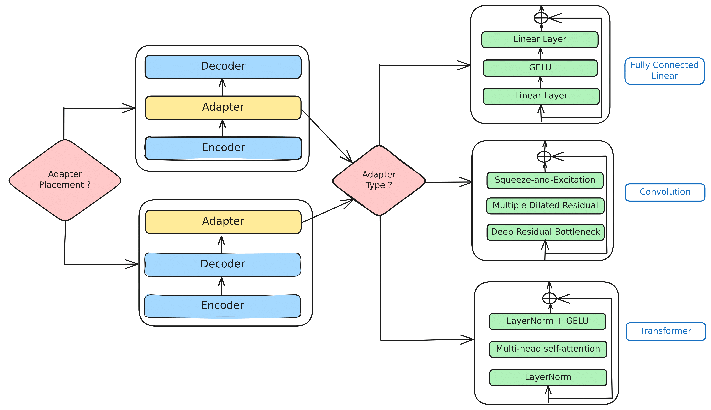
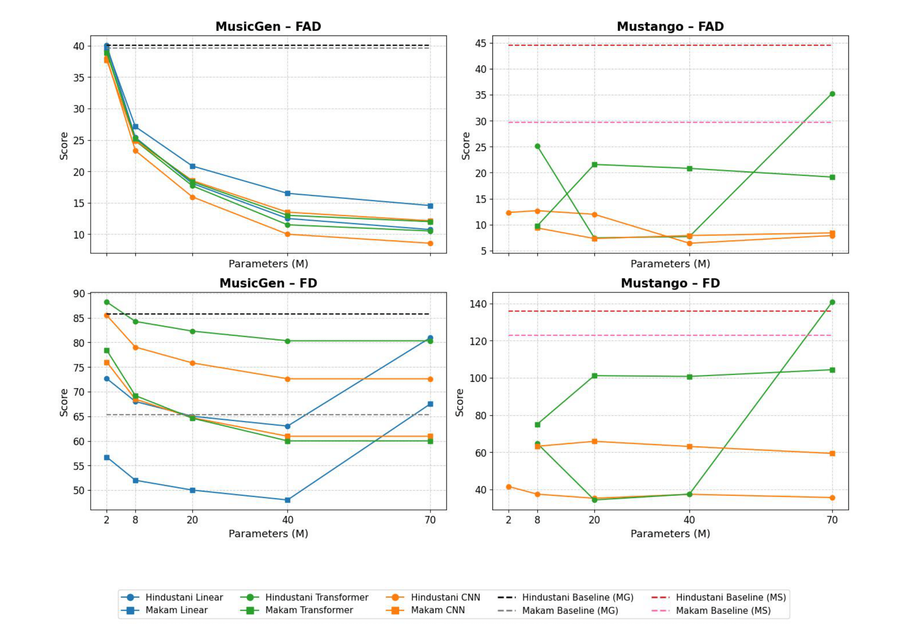

### Exploring Adapter Designs
This repository contains our code for the paper:  "Exploring Adapter Design Tradeoffs for Low Resource Music Generation"

Fine-tuning large-scale music generation models, such as MusicGen and Mustango, is a computationally expensive process, often requiring updates to billions of parameters and, therefore, significant hardware resources. 
Parameter-Efficient Fine-Tuning (PEFT) techniques, particularly adapter-based methods, have emerged as a promising alternative, enabling adaptation with minimal trainable parameters while preserving model performance. 
However, the design choices for adapters, including their architecture, placement, and size, are numerous, and it is unclear which of these combinations would produce optimal adapters and why, for a given case of low-resource music genre. 
In this paper, we attempt to answer this question by studying various adapter configurations for two AI music models, MusicGen and Mustango, on two genres: Hindustani Classical and Turkish Makam music.

## Datasets

The [Compmusic - Turkish Makam](https://compmusic.upf.edu/datasets) dataset contains 405 hours of Turkish Makam and Hindustani Classical data.

The [Compmusic - Hindustani Classical](https://compmusic.upf.edu/datasets) dataset contains 305 hours of Hindustani Classical annotated data.

The Hindustani Classical dataset includes 21 different instrument types, such as the Pakhavaj, Zither, Sarangi, Ghatam, Harmonium,
and Santoor, along with vocals.

The Turkish Makam dataset features 42 makam-specific instruments, such as Oud, Tanbur, Ney, Davul, Clarinet, Kös, Kudüm,
Yaylı Tanbur, Tef, Kanun, Zurna, Bendir, Darbuka, Classical Kemençe, Rebab, Çevgen, and vocals. It encompasses 100 different
makams and 62 distinct usuls.

## Adapter Positioning

<div align="center">
  
</div>

### Mustango
To enhance this process, a Bottleneck Residual Adapter with convolution layers is integrated into the up-sampling, middle, and down-sampling blocks of the UNet, positioned just after the cross-attention block. This design facilitates cultural adaptation while preserving computational efficiency. The adapters reduce channel dimensions by a factor of 8, using a kernel size of 1 and GeLU activation after the down-projection layers to introduce non-linearity.

### MusicGen
In MusicGen, we enhance the model with an additional 2 million parameters by integrating Linear Bottleneck Residual Adapter after the transformer decoder within the MusicGen architecture after thorough experimentation with other placements.

The total parameter count of both the models is ~2 billion, making the adapter only 0.1% of the total size (2M params).
For both models, we used two RTX A6000 GPUs over a period of around 10 hours. The adapter block was fine-tuned, using the AdamW optimizer using MSE (Reconstruction Loss).

## Evaluations
### **Objective Evaluation Metrics for Music Models**
<div align="center">
  
</div>

### **Human Evaluation**  
Hindustani Classical - Subjective Evaluation Results
<div align="center">
  
</div>

Turkish Makam = Subjective Evaluation Results
<div align="center">
  
</div>


## Citation
Please consider citing the following article if you found our work useful:
```
@misc{
  
}
```
